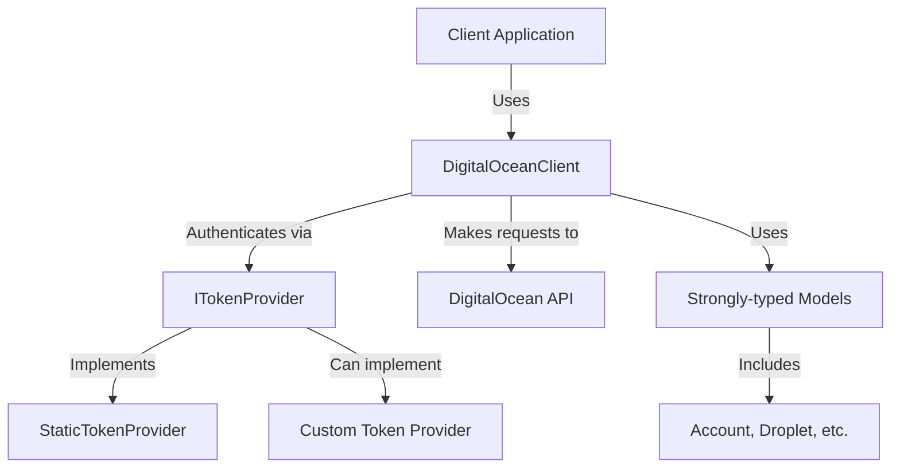

# InfinityFlow.DigitalOcean.Client

[](https://github.com/InfinityFlowApp/InfinityFlow.DigitalOcean.Client/actions?query=branch%3Amain)
[](https://github.com/InfinityFlowApp/InfinityFlow.DigitalOcean.Client/releases)
[](https://github.com/InfinityFlowApp/InfinityFlow.DigitalOcean.Client?tab=MIT-1-ov-file)
[](https://www.nuget.org/packages/InfinityFlow.DigitalOcean.Client)

[](https://discord.gg/PXJFbP7PKk)

A strongly-typed .NET client for the DigitalOcean API, generated using Microsoft's Kiota SDK generator. This client provides a simple and intuitive way to interact with DigitalOcean's services from .NET applications.

## Architecture Overview



## Features

- Complete coverage of the DigitalOcean API v2
- Strongly-typed models for all API entities
- Asynchronous API for non-blocking operations
- Authentication options for API tokens
- Easy integration with dependency injection
- Generated from the OpenAPI specification
- Comprehensive error handling

## Installation

Install the package from NuGet:

```bash
dotnet add package InfinityFlow.DigitalOcean.Client
```

## Quick Start

### Basic Usage

```csharp
// Create a client with an API token
var tokenProvider = new StaticTokenProvider("your-digitalocean-api-token");
var httpClient = new HttpClient();
var client = new DigitalOceanClient(httpClient, tokenProvider);

// Get account information
var account = await client.Account.GetAsync();
Console.WriteLine($"Account: {account.Email}, {account.Status}");

// List all droplets
var droplets = await client.Droplets.GetAsync();
foreach (var droplet in droplets.Droplets)
{
    Console.WriteLine($"Droplet: {droplet.Name}, {droplet.Status}");
}
```

### Dependency Injection Setup

```csharp
// In Program.cs or Startup.cs
services.AddDigitalOceanClient(options =>
{
    options.Token = Configuration["DigitalOcean:ApiToken"];
});

// In your service
public class MyService
{
    private readonly DigitalOceanClient _client;
    
    public MyService(DigitalOceanClient client)
    {
        _client = client;
    }
    
    public async Task DoSomethingAsync()
    {
        var droplets = await _client.Droplets.GetAsync();
        // ...
    }
}
```

## API Coverage

This client covers all DigitalOcean API endpoints:

- Account
- Actions
- Apps
- Billing
- Block Storage
- CDN Endpoints
- Certificates
- Container Registry
- Databases
- DNS (Domains)
- Droplets
- Firewalls
- Floating IPs
- Kubernetes
- Load Balancers
- Monitoring
- Projects
- Regions
- Reserved IPs
- Sizes
- Snapshots
- SSH Keys
- Tags
- VPCs

## Authentication

The client supports authentication using a DigitalOcean API token:

```csharp
// Static token provider (simple approach)
var tokenProvider = new StaticTokenProvider("your-api-token");

// For more dynamic scenarios, implement ITokenProvider
public class MyTokenProvider : ITokenProvider
{
    public Task<string> GetTokenAsync(CancellationToken cancellationToken)
    {
        // Get token from a secure storage or service
        return Task.FromResult(GetSecureToken());
    }
}
```

## Advanced Usage

### Request Options

You can customize requests with options:

```csharp
// Get droplets with paging
var options = new DropletsRequestBuilder.GetRequestConfiguration
{
    QueryParameters = new DropletsRequestBuilder.GetQueryParameters
    {
        Page = 2,
        PerPage = 25
    }
};

var droplets = await client.Droplets.GetAsync(requestConfiguration: options);
```

### Error Handling

The client throws strongly-typed exceptions for API errors:

```csharp
try
{
    var droplet = await client.Droplets.ByDropletId(123456).GetAsync();
    // Process droplet
}
catch (DigitalOceanApiException ex) when (ex.StatusCode == 404)
{
    Console.WriteLine("Droplet not found");
}
catch (DigitalOceanApiException ex)
{
    Console.WriteLine($"API error: {ex.StatusCode}, {ex.Message}");
}
catch (Exception ex)
{
    Console.WriteLine($"Unexpected error: {ex.Message}");
}
```

### Creating Resources

Creating resources is type-safe and intuitive:

```csharp
// Create a new droplet
var newDroplet = new Droplet
{
    Name = "example-droplet",
    Region = "nyc3",
    Size = "s-1vcpu-1gb",
    Image = 123456789, // Ubuntu image ID
    SshKeys = new List<int> { 123456 }, // SSH key ID
    Backups = false,
    Ipv6 = true,
    Monitoring = true,
    Tags = new List<string> { "web", "production" }
};

var createdDroplet = await client.Droplets.PostAsync(newDroplet);
Console.WriteLine($"Created droplet with ID: {createdDroplet.Id}");
```

## Models

The client includes strongly-typed models for all DigitalOcean entities. Here are some key models:

```csharp
// Account information
public class Account
{
    public string Email { get; set; }
    public string Status { get; set; }
    public Account_status Status_enum { get; set; }
    public bool Droplet_limit { get; set; }
    public bool Email_verified { get; set; }
    public Account_team Team { get; set; }
    public DateTimeOffset Created_at { get; set; }
}

// Droplet configuration
public class Droplet
{
    public int Id { get; set; }
    public string Name { get; set; }
    public int Memory { get; set; }
    public int Vcpus { get; set; }
    public int Disk { get; set; }
    public string Region { get; set; }
    public string Size { get; set; }
    public string Status { get; set; }
    // Additional properties...
}

// Many other models available...
```

## Development

### Building from Source

```bash
git clone https://github.com/InfinityFlowApp/InfinityFlow.DigitalOcean.Client.git
cd InfinityFlow.DigitalOcean.Client
dotnet build
```

### Running Tests

```bash
dotnet test
```

### Generating a New Client

The client is generated using Kiota:

```bash
# Install Kiota
dotnet tool install -g Microsoft.OpenAPI.Kiota

# Get the OpenAPI specification
curl -o openapi.json https://raw.githubusercontent.com/digitalocean/openapi/master/specification/DigitalOcean-public.v2.yaml

# Generate the client
kiota generate --language CSharp --namespace InfinityFlow.DigitalOcean.Client --output-dir ./src/InfinityFlow.DigitalOcean.Client --openapi openapi.json --class-name DigitalOceanClient --clean-output
```

## Contributing

We welcome contributions! Please feel free to submit a Pull Request.

1. Fork the repository
2. Create your feature branch (`git checkout -b my-new-feature`)
3. Commit your changes (`git commit -am 'Add some feature'`)
4. Push to the branch (`git push origin my-new-feature`)
5. Create a new Pull Request

## License

This project is licensed under the MIT License - see the [LICENSE](LICENSE) file for details.

## Acknowledgments

- Generated using [Microsoft Kiota](https://github.com/microsoft/kiota)
- API specification from [DigitalOcean OpenAPI](https://github.com/digitalocean/openapi)

## Troubleshooting

### Common Issues and Solutions

| Issue | Solution |
|-------|----------|
| 401 Unauthorized | Verify your API token is valid and has the required scopes |
| 429 Too Many Requests | Implement rate limiting or exponential backoff in your application |
| Connection timeout | Check your network connection and DigitalOcean status page |
| Serialization errors | Ensure you're using the latest client version compatible with the API |

### Debugging

Enable detailed logging by configuring your logger:

```csharp
// Setup logging (using Microsoft.Extensions.Logging)
services.AddLogging(builder =>
{
    builder.AddConsole();
    builder.AddDebug();
    builder.SetMinimumLevel(LogLevel.Debug);
});

// Add client with logging
services.AddDigitalOceanClient(options =>
{
    options.Token = Configuration["DigitalOcean:ApiToken"];
    options.EnableDebugLogging = true;
});
```

### Rate Limiting

The DigitalOcean API implements rate limiting. You can handle this by checking response headers:

```csharp
try
{
    var result = await client.Droplets.GetAsync();
    // Process result
}
catch (DigitalOceanApiException ex) when (ex.StatusCode == 429)
{
    // Get rate limit headers
    var rateLimit = ex.ResponseHeaders.GetValueOrDefault("RateLimit-Limit");
    var rateLimitRemaining = ex.ResponseHeaders.GetValueOrDefault("RateLimit-Remaining");
    var rateLimitReset = ex.ResponseHeaders.GetValueOrDefault("RateLimit-Reset");
    
    // Implement backoff strategy
    var resetTime = DateTimeOffset.FromUnixTimeSeconds(long.Parse(rateLimitReset));
    var waitTime = resetTime - DateTimeOffset.UtcNow;
    
    Console.WriteLine($"Rate limited. Waiting for {waitTime.TotalSeconds} seconds before retrying.");
    await Task.Delay(waitTime);
    
    // Retry the request
    result = await client.Droplets.GetAsync();
}
```